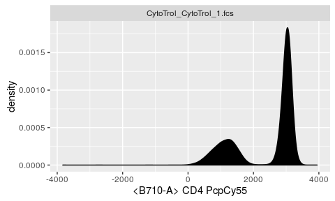
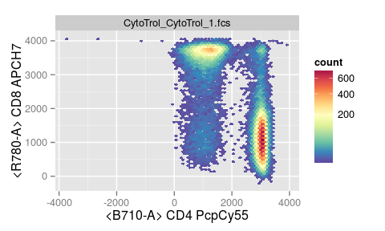
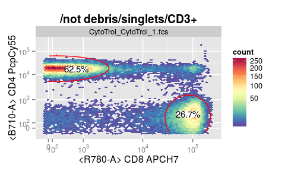
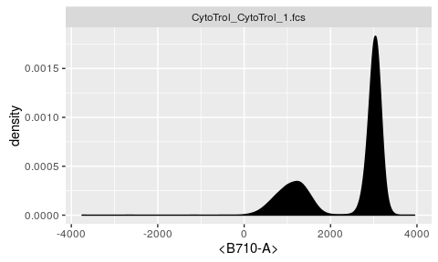
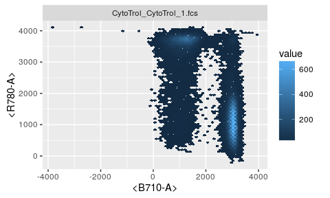

# ggcyto : Visualize `Cytometry` data with `ggplot`


### Overloaded `fortify` S3 method makes `Cytometry` data to be fully compatible with `ggplot`. 


```r
library(ggcyto)
dataDir <- system.file("extdata",package="flowWorkspaceData")
gs <- load_gs(list.files(dataDir, pattern = "gs_manual",full = TRUE))
fs <- getData(gs, "CD3+")
```

### Quick plot with [autoplot](vignettes/autplot.md) 

```r
#1d
autoplot(fs, "CD4")
```

 

```r
#2d
autoplot(fs, "CD4", "CD8", bins = 64)
```

 

```r
autoplot(gs, "singlets", bins = 64)
```

 

### More flexibility with **ggcyto** wrapper

#### [ggcyto + flowSet](vignettes/ggcyto.flowSet.md)

```r
# support fuzzy-matching of aes to the data
# with flowJo-type of default color fills
# facet on `name` by default
ggcyto(fs,aes(x = CD4, y = CD8)) + geom_hex(bins = 64) + xlim(0, 3600)
```

 

#### [ggcyto + GatingSet](vignettes/ggcyto.GatingSet.md)

```r
ggcyto(gs,aes(x = CCR7, y = CD45RA), subset = "CD4") + geom_hex(bins = 64) + geom_gate("CD4/CCR7+ 45RA+") + geom_stats(fill = "yellow", size = 4)
```

 

### Use `ggplot` directly to have more controls. 

```r
# 1d
p <- ggplot(fs, aes(x = `<B710-A>`)) + facet_wrap(~name) 
#histogram plot
p + geom_histogram(colour = "white")
```

 

```r
#density plot
p + geom_density(fill = "black")
```

 

```r
# 2d hexbin
ggplot(fs, aes(x = `<B710-A>`, y = `<R780-A>`)) + facet_wrap(~name) + geom_hex(bins = 64)
```

 

More examples of using `ggplot` directly on `flowSet`:

* [ggplot + flowSet1d](vignettes/ggplot.flowSet.1d.md)
* [ggplot + flowSet2d](vignettes/ggplot.flowSet.2d.md)
* [ggplot + flowSet + gate](vignettes/ggplot.flowSet.gate.md)
* [ggplot + flowSet + overlay](vignettes/ggplot.flowSet.overlay.md)
