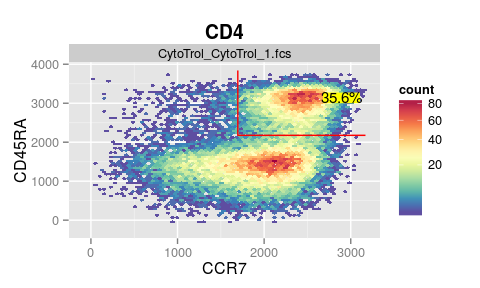
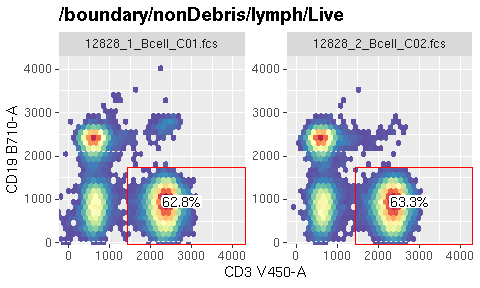
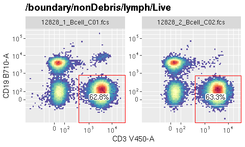
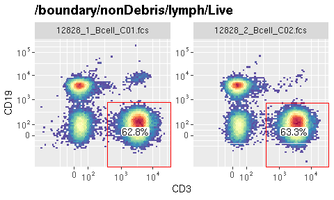
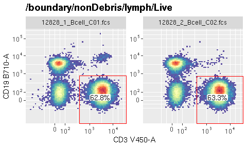
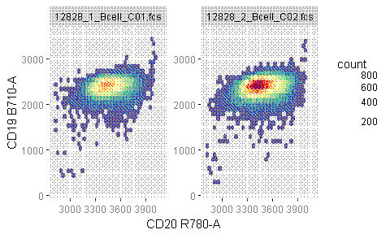
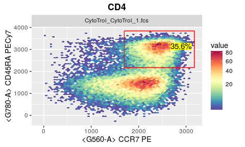
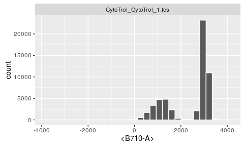
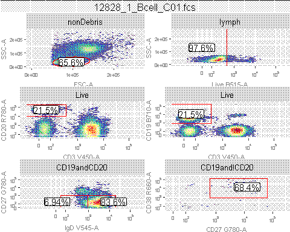
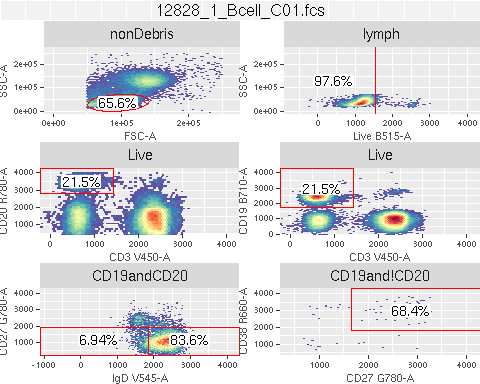

# ggcyto : Visualize `Cytometry` data with `ggplot`'


`ggcyto` is a cytometry data visualization tool built around ggplot and the grammar of graphics paradigm. The software extends the popular ggplot2 framework, already familiar to many data scientists, enabling it to recog-nize the core Bioconductor flow cytometry data structures for gated and annotated cytometry data. It simplifies visualization and plotting of flow data for publication quality graphics. 


There are three ways to construct the `ggcyto` plots. Each represents a different level of complexity and flexibility.  They meet the needs of various plot applications and thus are suitable for users at different levels of coding skills.

# Quick plot

This inherits the spirit from ggplot's `Quick plot`, which simplies the plotting job by hiding more details from users and taking more assumptions for the plot.

* see [autoplot](vignettes/autoplot.md)

# More flexibility with **ggcyto** wrapper

`ggcyto` constructor along with overloaded `+` operator gives user more flexibility to fine-tune the plot yet still encapsulates lots of details that might be tedious and intimidating for many users.

See more examples of `ggcyto` constructor here:

* [ggcyto + flowSet](vignettes/ggcyto.flowSet.md)
* [ggcyto + GatingSet](vignettes/ggcyto.GatingSet.md)

# Use `ggplot` directly to have more controls. 
The package overloads ggplot's `fortify` S3 method so that `Cytometry` data structures (e.g. `flowSet/flowFrame`) are fully compatible with `ggplot`. More examples of using `ggplot` directly on `flowSet`:

* [ggplot + flowSet1d](vignettes/advanced/ggplot.flowSet.1d.md)
* [ggplot + flowSet2d](vignettes/advanced/ggplot.flowSet.2d.md)
* [ggplot + flowSet + gate](vignettes/advanced/ggplot.flowSet.gate.md)
* [ggplot + flowSet + overlay](vignettes/advanced/ggplot.flowSet.overlay.md)

# quick demos of some most used features 


```r
library(ggcyto)
dataDir <- system.file("extdata",package="flowWorkspaceData")
gs <- load_gs(list.files(dataDir, pattern = "gs_bcell_auto",full = TRUE))
```


```r
#plot a gate by specifying the population node name (here it is 'CD3')
autoplot(gs, "CD3")
```

<!-- -->

```r
#change the resolution
p <- autoplot(gs, "CD3", bins = 64)
p
```

<!-- -->

```r
#display the transformed value at breaks label by turning off the inverse transform
autoplot(gs, "CD3", axis_inverse_trans = FALSE)
```

<!-- -->

```r
#you can switch the limits from default `instrument` to the actual `data` range
p + ggcyto_par_set(limits = "data")
```

<!-- -->

```r
# Choose between `marker` and `channel` names for axis label text
p + labs_cyto("channel") #default is "both"
```

<!-- -->

```r
# overlay another population 'IgD-CD27-' as dots on top of the existing plot
p + geom_overlay("IgD-CD27-", alpha = 0.5, size = 0.1, color = "purple")
```

<!-- -->

```r
# plot a population without gate
fs <- getData(gs, "CD20") #extract the gated data as a flowSet
autoplot(fs, "CD20", "CD19") #plot 2D
```

<!-- -->


```r
autoplot(fs, "CD20") #1d density
```

<!-- -->

```r
#extract one sample as a flowFrame
fr <- fs[[1]]
#plot 1d density on all available channels
autoplot(fr)
```

<!-- -->

 

```r
gh <- gs[[1]] # extract a `GatingHierarchy` object for one sample
# layout multiple cell populations with their asssociated gates in the same plot.
nodes <- getNodes(gh)[c(3:9, 14)]
p <- autoplot(gh, nodes, bins = 64)
p
```

<!-- -->


```r
#arrange it as one-row gtable object
gt <- ggcyto_arrange(p, nrow = 1)
plot(gt)
```

<!-- -->


