# ggcyto : Visualize `Cytometry` data with `ggplot`


```r
library(ggcyto)
dataDir <- system.file("extdata",package="flowWorkspaceData")
```

## 1: suppoort `3` types of plot constructor 

* represent different levels of complexity and flexibility
* meet the needs of various plot applications
* suitable for users at different levels of coding skills.

### low level: `ggplot`

The overloaded `fority` methods empower `ggplot`  to work with all the major Cytometry data structures right away, which allows users to do all kinds of highly customized and versitled plots.

#### `GatingSet`

```r
gs <- load_gs(list.files(dataDir, pattern = "gs_manual",full = TRUE))
attr(gs, "subset") <- "CD3+"
ggplot(gs, aes(x = `<B710-A>`, y = `<R780-A>`)) + geom_hex(bins = 128) + scale_fill_gradientn(colours = gray.colors(9))
```

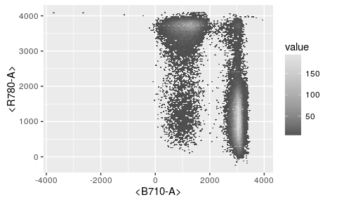

#### `flowSet/ncdfFlowSet/flowFrame` 

```r
fs <- getData(gs, "CD3+")
ggplot(fs, aes(x = `<B710-A>`)) + geom_density(fill = "blue", alpha= 0.5)
```

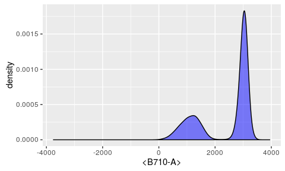

#### `gates`

```r
gates <- filterList(getGate(gs, "CD8"))
ggplot(gs, aes(x = `<B710-A>`, y = `<R780-A>`)) + geom_hex(bins = 128) + geom_polygon(data = gates, fill = "transparent", col = "purple")
```

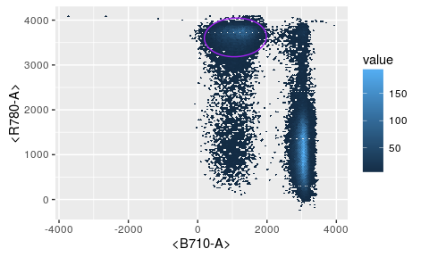

### medium level: `ggcyto`

`ggcyto` constructor along with overloaded `+` operator encapsulate lots of details that might be tedious and intimidating for many users.


```r
ggcyto(gs, aes(x = CD4, y = CD8)) + geom_hex(bins = 128) + geom_gate("CD8")
```

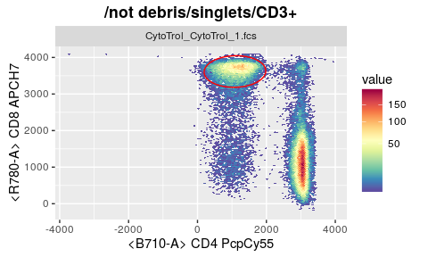

It simplies the plotting by:
* add a default scale_fill_gradientn for you
* fuzzy-matching in `aes` by either detector or fluorochromes names
* determine the `parent` popoulation automatically
* exact and plot the gate object by simply referring to the `child` population name

### top level: `autoplot`
Inheriting the spirit from ggplot's `Quick plot`, it further simply the plotting job by hiding more details from users and taking more assumptions for the plot.

* when plotting `flowSet`, it determines `geom` type automatically by the number of `dim` supplied 
* for `GatingSet`, it further skip the need of `dim` by guessing it from the `children` gate


```r
#1d
autoplot(fs, "CD4")
```


```r
#2d
autoplot(fs, "CD4", "CD8", bins = 64)
```

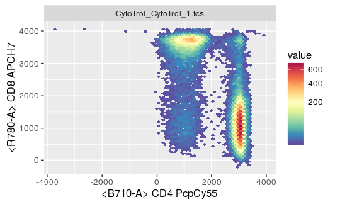

```r
autoplot(gs, c("CD4", "CD8"), bins = 64)
```

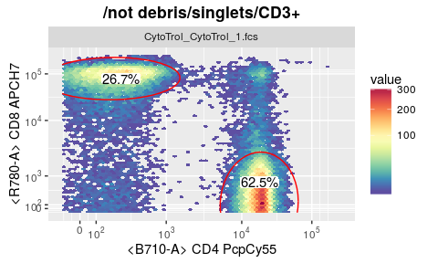

## 2: in-line transformation 
It is done by different `scales` layers speically designed for `cytometry`

```r
data(GvHD)
fr <- GvHD[[1]]
p <- autoplot(fr, "FL1-H")
p #raw scale
```

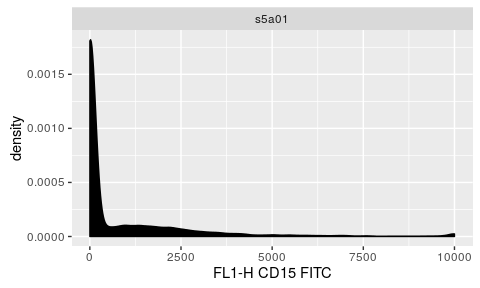

```r
p + scale_x_logicle() #flowCore logicle scale
```

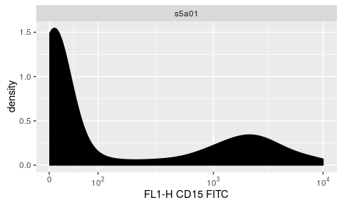

```r
p + scale_x_flowJo_fasinh() # flowJo fasinh
```

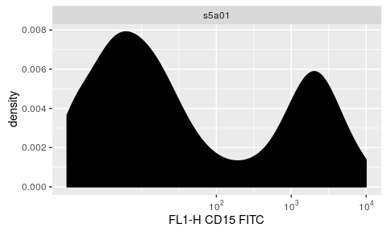

```r
p + scale_x_flowJo_biexp() # flowJo biexponential
```

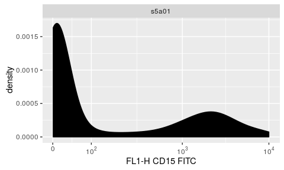

## 3: generic `geom_gate` layer 
It hides the complex details pf plotting different geometric shapes


```r
fr <- fs[[1]]
p <- autoplot(fr,"CD4", "CD8") + ggcyto_par_set(limits = "instrument")
#1d gate vertical
gate_1d_v <- openCyto::mindensity(fr, "<B710-A>")
p + geom_gate(gate_1d_v)
```

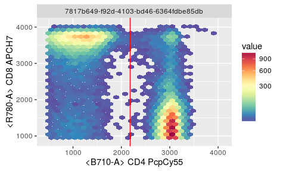

```r
#1d gate horizontal
gate_1d_h <- openCyto::mindensity(fr, "<R780-A>")
p + geom_gate(gate_1d_h)
```


```r
#2d rectangle gate
gate_rect <- rectangleGate("<B710-A>" = c(gate_1d_v@min, 4e3), "<R780-A>" = c(gate_1d_h@min, 4e3))
p + geom_gate(gate_rect)
```

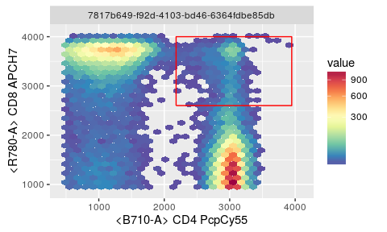

```r
#ellipsoid Gate
gate_ellip <- getGate(gs[[1]], "CD4")
class(gate_ellip)
```

```
## [1] "ellipsoidGate"
## attr(,"package")
## [1] "flowCore"
```

```r
p + geom_gate(gate_ellip)
```

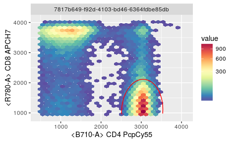


## 4: `geom_stats` 

```r
p <- ggcyto(gs, aes(x = "CD4", y = "CD8"), subset = "CD3+") + geom_hex()
p + geom_gate("CD4") + geom_stats()
```


```r
p + geom_gate("CD4") + geom_stats(type = "count") #display cell counts 
```

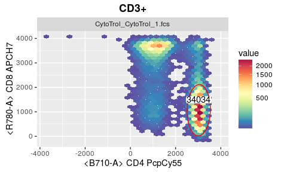


## 5: `axis_inverse_trans` 
It can display the `log` scaled data in the original value

```r
p # axis display the transformed values
```


```r
p + axis_x_inverse_trans() # restore the x axis to the raw values
```

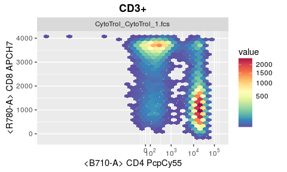

It currently only works with `GatingSet`.

## 6: auto limits
Optionally you can set limits by `instrument` or `data` range

```r
p <- p + ggcyto_par_set(limits = "instrument")
p
```

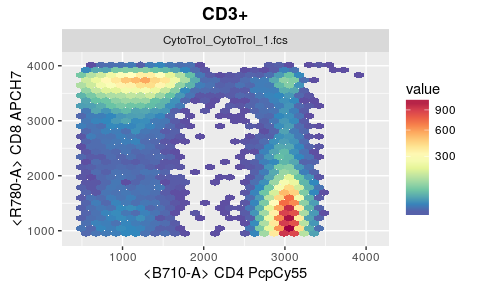

## 7: labs_cyto
You can choose between `marker` and `channel` names (or `both` by default)

```r
p + labs_cyto("markers")
```


## 8: `ggcyto_par_set` 
It aggregates the different settings in one layer

```r
#put all the customized settings in one layer
mySettings <- ggcyto_par_set(limits = "instrument"
                             , facet = facet_wrap("name")
                             , hex_fill = scale_fill_gradientn(colours = rev(RColorBrewer::brewer.pal(11, "Spectral")))
                            , lab = labs_cyto("marker")
                            )
# and use it repeatly in the plots later (similar to the `theme` concept)
p + mySettings
```

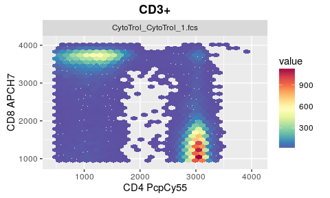

Currently we only support `4` settings, but will add more in future.

## 9: `as.ggplot` 
It allows user to convert `ggcyto` objects to pure `ggplot` objects for further the manipulating jobs that can not be done within `ggcyto` framework.

```r
class(p) # may not fully compatile with all the `ggplot` functions
```

```
## [1] "ggcyto_GatingSet"
## attr(,"package")
## [1] "ggcyto"
```

```r
p1 <- as.ggplot(p)
class(p1) # a pure ggplot object, thus can work with all the `ggplot` features
```

```
## [1] "gg"     "ggplot"
```

## 10: ggcyto_layout

Layout many gate plots on the same page

When plooting a `GatingHierarchy`, multiple cell populations with their asssociated gates can be plotted in different panels of the same plot.

```r
gh <- gs[[1]]
nodes <- getNodes(gh, path = "auto")[c(3:9, 14)]
nodes
```

```
## [1] "singlets"    "CD3+"        "CD4"         "CD4/38- DR+" "CD4/38+ DR+"
## [6] "CD4/38+ DR-" "CD4/38- DR-" "CD8"
```

```r
autoplot(gh, nodes, bins = 64)
```

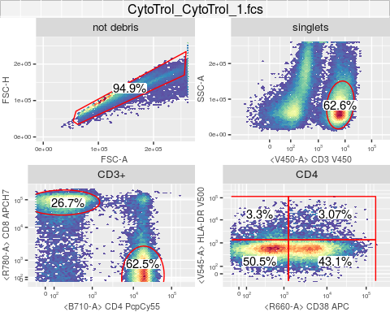


More examples:

* [ggplot + flowSet1d](vignettes/advanced/ggplot.flowSet.1d.md)
* [ggplot + flowSet2d](vignettes/advanced/ggplot.flowSet.2d.md)
* [ggplot + flowSet + gate](vignettes/advanced/ggplot.flowSet.gate.md)
* [ggplot + flowSet + overlay](vignettes/advanced/ggplot.flowSet.overlay.md)
