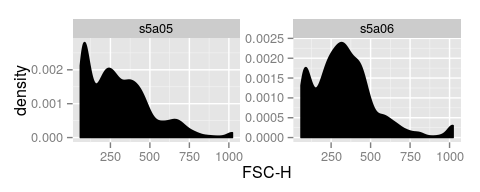
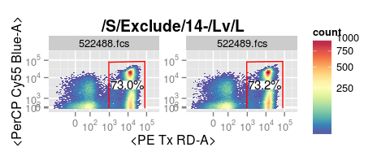
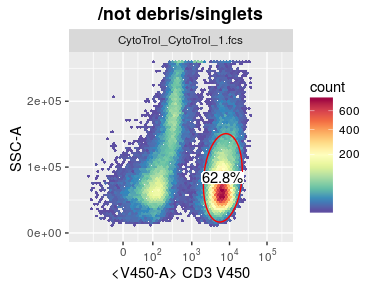
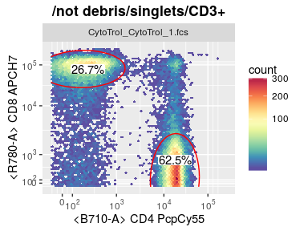
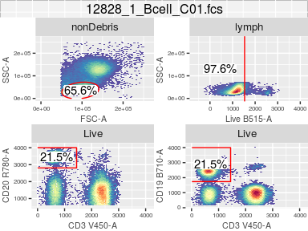
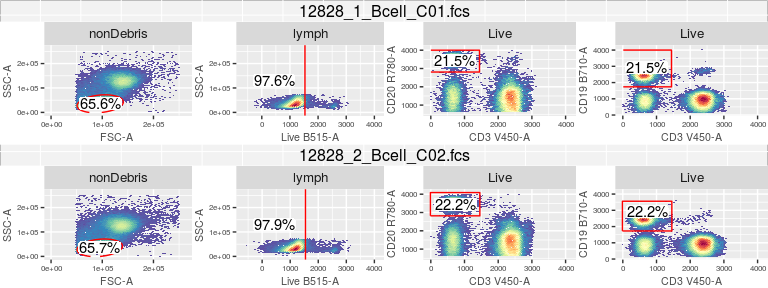

# Quick plot for cytometry data


```r
library(ggcyto)
dataDir <- system.file("extdata",package="flowWorkspaceData")
gs <- load_gs(list.files(dataDir, pattern = "gs_bcell_auto",full = TRUE))
data(GvHD)
fs <- GvHD[subset(pData(GvHD), Patient %in%5 & Visit %in% c(5:6))[["name"]]]
```

## `flowSet`
`geom_density` layer is used for one-dimensional plot.

```r
autoplot(fs, x = 'FSC-H')
```



`geom_hex` layer is added for 2d plot.

```r
autoplot(fs, x = 'FSC-H', y = 'SSC-H', bins = 64)
```



## `GatingSet` 

```r
autoplot(gs, "CD3", bins = 64)
```



Here are some default settings applied:

* The instrument range is applied by default (through `ggcyto_par_set(limits = "instrument")`).
* "CD3" gate is plotted aganst its the parent population: "Live"."
* Axis labels are inverse transformed through `axis_x_inverse_trans/axis_x_inverse_trans`.


Multiple gates that share the same parent can be plotted together.

```r
autoplot(gs, c("CD3", "CD19"), bins = 64)
```



## `GatingHierarchy`
Multiple cell populations with their asssociated gates can be plotted in different panels of the same plot.

```r
gh <- gs[[1]]
nodes <- getNodes(gh, path = "auto")[c(3:6)]
nodes
```

```
## [1] "lymph" "Live"  "CD20"  "CD19"
```

```r
autoplot(gh, nodes, bins = 64)
```



## `ggcyto_arrange`
Optionally we can manually arrange it as a `gtable` object and manipulate the layout afterwards.

```r
# get ggcyto_GatingLayout object from first sample
res <- autoplot(gs[[1]], nodes, bins = 64)
class(res)
```

```
## [1] "ggcyto_GatingLayout"
## attr(,"package")
## [1] "ggcyto"
```

```r
# arrange it as one-row gtable object 
gt <- ggcyto_arrange(res, nrow = 1)
gt
```

```
## TableGrob (2 x 4) "arrange": 5 grobs
##       z     cells    name                grob
## lymph 1 (2-2,1-1) arrange      gtable[layout]
## Live  2 (2-2,2-2) arrange      gtable[layout]
## CD20  3 (2-2,3-3) arrange      gtable[layout]
## CD19  4 (2-2,4-4) arrange      gtable[layout]
##       5 (1-1,1-4) arrange text[GRID.text.863]
```

```r
# do the same to the second sample
gt2 <- ggcyto_arrange(autoplot(gs[[2]], nodes, bins = 64), nrow = 1)
# combine the two and print it on the sampe page
gt3 <- gridExtra::gtable_rbind(gt, gt2)
plot(gt3)
```




