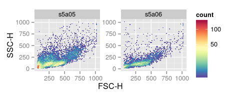
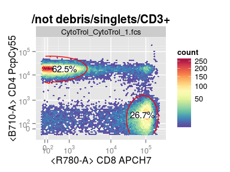
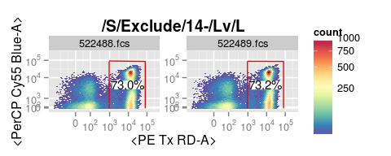
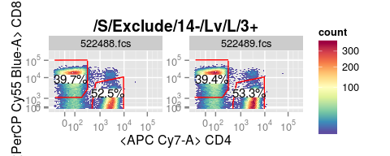

# Quick plot for cytometry data


```r
library(ggcyto)
gs <- load_gs("/fh/fast/gottardo_r/mike_working/HVTN/086/orig/1665-Y-086/")
gs <- gs[1:2]
data(GvHD)
fs <- GvHD[subset(pData(GvHD), Patient %in%5 & Visit %in% c(5:6))[["name"]]]
```

## `flowSet`

```r
## 1d densityplot
autoplot(fs, x = 'FSC-H')
```

 

```r
## 2d hex
autoplot(fs, x = 'FSC-H', y = 'SSC-H', bins = 64)
```

 

## `GatingSet` 

```r
# apply the instrument range by default
# use direct parent
# inverse trans axis
p <- autoplot(gs, "3+", bins = 64)
p
```

 

```r
# display marker only
p + labs_cyto("marker")
```

 

```r
# display channel only
p + labs_cyto("channel")
```

 

```r
# multiple
autoplot(gs, c("4+", "8+"), bins = 64)
```

 

## `GatingHierarchy`

```r
gh <- gs[[1]]
nodes <- c("Lv", "L", "3+", "4+", "8+")
# default use grid.arrange
autoplot(gh, nodes, bins = 64)
```

 

```r
# disable arrange and receive a list of ggplot objects to manually arrange
objs <- autoplot(gh, nodes, bins = 64, arrange = F)
length(objs)
```

```
## [1] 4
```

```r
class(objs[[1]])
```

```
## [1] "gg"     "ggplot"
```

```r
class(objs[[2]])
```

```
## [1] "gg"     "ggplot"
```

