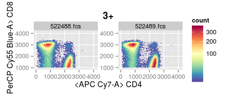
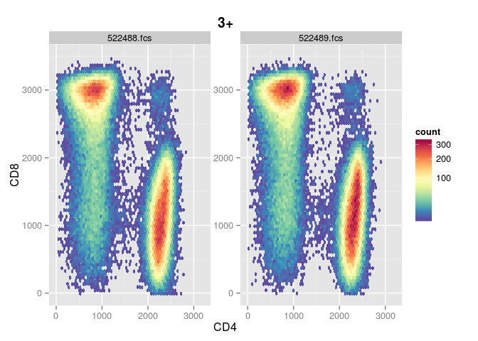
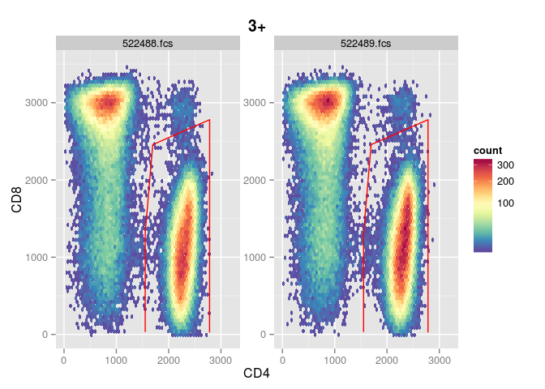
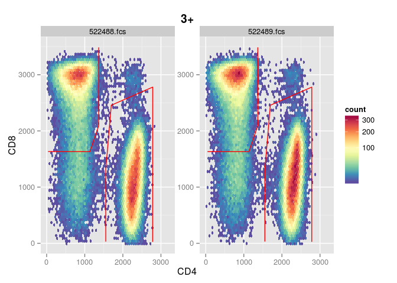
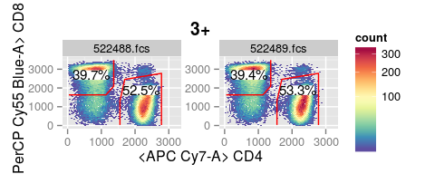
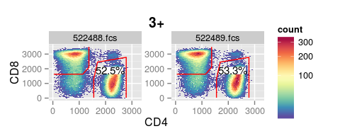
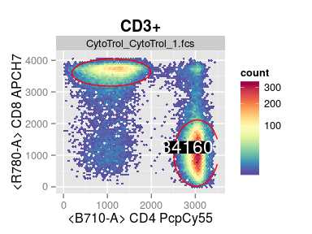
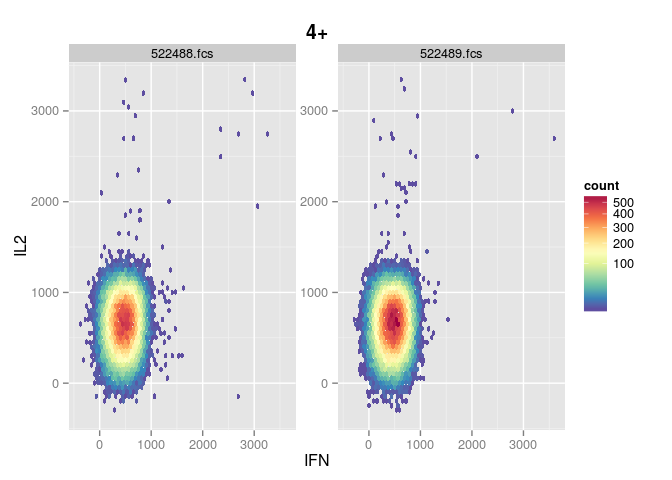
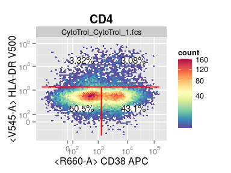
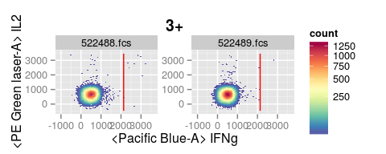

# Visualize GatingSet with ggcyto


```r
p <- ggcyto(gs, aes(x = CD4, y = CD8), subset = "3+") 
# 2d plot 
p <- p + geom_hex(bins = 64)
p
```

 

```r
#use instrument range by overwritting limits setting in the default theme
p + theme_ggcyto(limits = "instrument")
```

 

```r
#manually set limits
myTheme <- theme_ggcyto(limits = list(x = c(0,3.2e3), y = c(-10, 3.5e3)))
p <- p  + myTheme# or xlim(0,3.2e3) + ylim(-10, 3.5e3) 
p
```

 

```r
# print the default settings
theme_ggcyto_default()
```

```
## $limits
## [1] "data"
## 
## $facet
## facet_wrap(name) 
## 
## $hex_fill
## continuous_scale(aesthetics = "fill", scale_name = "gradientn", 
##     palette = gradient_n_pal(colours, values, space), na.value = na.value, 
##     trans = "sqrt", guide = guide)
## 
## $lab
## $labels
## [1] "both"
## 
## attr(,"class")
## [1] "labs_cyto"
## 
## attr(,"class")
## [1] "ggcyto_theme"
```

```r
# add gate
p + geom_gate("4+")
```

 

```r
# add two gates
p <- p + geom_gate(c("4+","8+")) # short for geom_gate("8+") + geom_gate("4+")
p
```

 

```r
# add stats (for all gate layers by default)
p + geom_stats()
```

 

```r
# add stats just for one specific gate
p + geom_stats("4+")
```

 

```r
# change stats type, background color and position
p + geom_stats("4+", type = "count", size = 6,  color = "yellow", fill = "black", adjust = 0.3)
```

 


```r
# 'subset' is abstract without specifiying it
p <- ggcyto(gs, aes(x = CD4, y = CD8)) + geom_hex() + myTheme
p
```

```
## Error in fortify_fs.GatingSet(x$data): 'subset' must be instantiated by the actual node name!
## Make sure either 'subset' is specified or the 'geom_gate' layer is added.
```


```r
# it can be instantiated by gate layer
p + geom_gate(c("4+", "8+"))
```

 

```r
# plot all children of the specified parent
p <- ggcyto(gs, aes(x = IFN, y = IL2), subset = "4+") + geom_hex(bins = 64)
p
```

 

```r
p + geom_gate() + geom_stats()
```

 

```r
# add gates to the arbitary(non-parent) node
p <- ggcyto(gs, subset = "3+", aes(x = IFNg, y = IL2)) + geom_hex(bins = 64) + geom_gate(c("4+/IFNg+"))
p
```

 

```r
#print the default theme settings
theme_ggcyto_default()
```

```
## $limits
## [1] "data"
## 
## $facet
## facet_wrap(name) 
## 
## $hex_fill
## continuous_scale(aesthetics = "fill", scale_name = "gradientn", 
##     palette = gradient_n_pal(colours, values, space), na.value = na.value, 
##     trans = "sqrt", guide = guide)
## 
## $lab
## $labels
## [1] "both"
## 
## attr(,"class")
## [1] "labs_cyto"
## 
## attr(,"class")
## [1] "ggcyto_theme"
```

```r
# inverse transform the axis without affecting the data
p + axis_x_inverse_trans() + axis_y_inverse_trans()
```

 

```r
#add filter (consistent with `margin` behavior in flowViz)
# ggcyto(gs, aes(x = CD4, y = CD8), subset = "3+", filter = marginalFilter)  + geom_hex(bins = 32, na.rm = T)
```


```r
class(p)
```

```
## [1] "ggcyto_GatingSet" "ggcyto_flowSet"   "ggcyto"          
## [4] "gg"               "ggplot"
```

```r
# knowing that for 'ggcyto' is the semi-ggplot object since the data slot is NOT fortified to data.frame
# until it is printed/plotted.
# (other than this it is completely ggplot compatible in terms of adding layers and themes)
class(p$data)
```

```
## [1] "GatingSet"
## attr(,"package")
## [1] "flowWorkspace"
```

```r
# To return a regular ggplot object
p <- as.ggplot(p)

class(p)
```

```
## [1] "gg"     "ggplot"
```

```r
class(p$data)
```

```
## [1] "data.table" "data.frame"
```


