# Visualize flowSet with ggcyto


```r
library(ggcyto)
data(GvHD)
fs <- GvHD[subset(pData(GvHD), Patient %in%5:7 & Visit %in% c(5:6))[["name"]]]
fr <- fs[[1]]
```

## 1d histogram/densityplot

```r
# construct the `ggcyto` object (inherits from `ggplot` class)
p <- ggcyto(fs, aes(x = `FSC-H`)) 
# `facet_wrap(~name)` is used automatically
p1 <- p + geom_histogram() 
p1
```

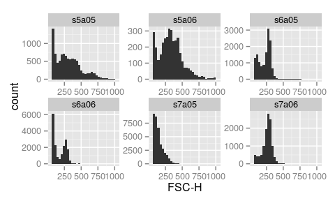 

```r
# overwriting the default faceeting
p1 + facet_grid(Patient~Visit)
```

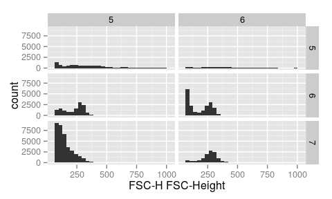 

```r
# display density
p + geom_density()
```

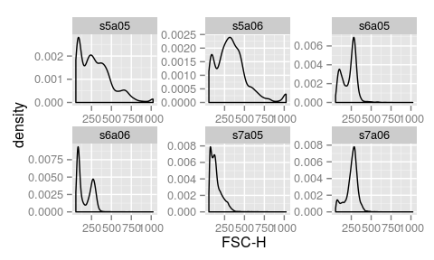 

```r
p + geom_density(fill = "black")
```

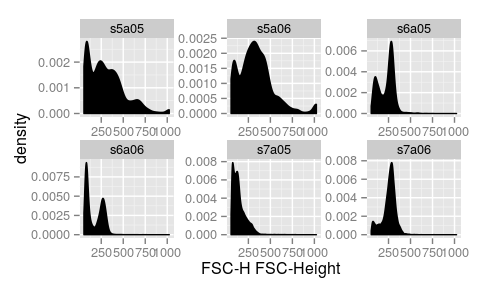 

```r
# fill with different colors
ggcyto(fs, aes(x = `FSC-H`, fill = name)) + geom_density(alpha = 0.2)
```

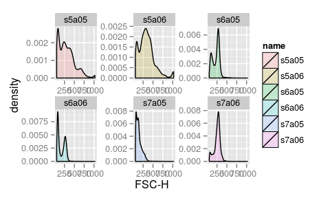 

```r
# or plot in the same panel by using `ggplot` directly (thus remove the default facetting effect)
ggplot(fs, aes(x = `FSC-H`, fill = name)) + geom_density(alpha = 0.2)
```

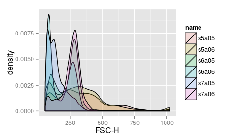 

## 2d scatter/dot plot

```r
# 2d hex
p <- ggcyto(fs, aes(x = `FSC-H`, y =  `SSC-H`))
p <- p + geom_hex(bins = 128)
p
```

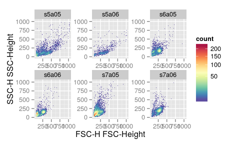 

```r
# add boundary limits
p <- p + ylim(c(10,9e2)) + xlim(c(10,9e2))   
p
```

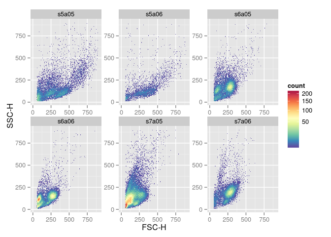 

```r
# browser()#it is so bizarre that without this knitr failed to proceed here

# overwrite the default fill gradien
p + scale_fill_gradientn(colours = rainbow(7), trans = "sqrt")
```

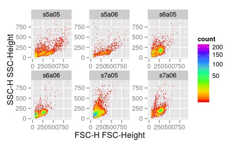 

```r
p + scale_fill_gradient(trans = "sqrt", low = "gray", high = "black")
```

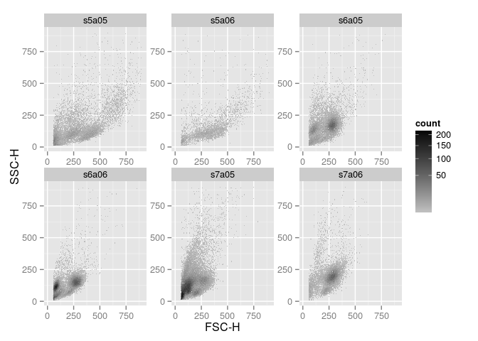 

## add `geom_gate` and `geom_stats` layers

```r
# estimate a lymphGate
lg <- flowStats::lymphGate(fr, channels=c("FSC-H", "SSC-H"),scale=0.6)
norm.filter <- lg$n2gate
#fit norm2 filter to multiple samples
fres <- filter(fs, norm.filter)
#extract the polygonGate for each sample
poly.gates <- lapply(fres, function(res)flowViz:::norm2Polygon(filterDetails(res, "defaultLymphGate")))

# add  gate layer
p + geom_gate(poly.gates)
```

 

```r
# add rectangleGate layer (2d)
rect.g <- rectangleGate(list("FSC-H" =  c(300,500), "SSC-H" = c(50,200)))
rect.gates <- sapply(sampleNames(fs), function(sn)rect.g)
p + geom_gate(rect.gates)
```

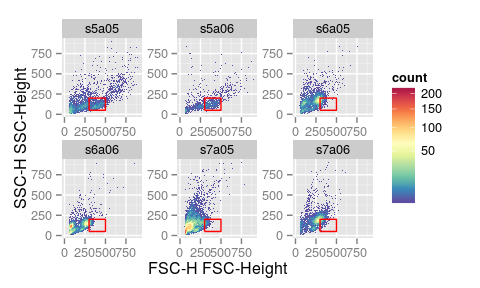 

```r
#add stats layer
p + geom_gate(rect.gates) + geom_stats(size = 3)
```

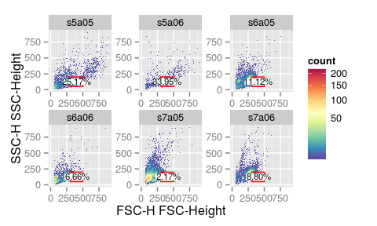 

```r
# a list of 1d gate
den.gates.x <- fsApply(fs, openCyto::mindensity, channel = "FSC-H", gate_range = c(100, 300), adjust = 1)
p + geom_gate(den.gates.x) + geom_stats()
```

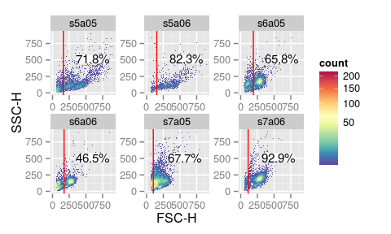 

```r
# 1d gate on another dimesion
den.gates.y <- fsApply(fs, openCyto::mindensity, channel = "SSC-H", gate_range = c(100, 500), adjust = 1, positive = FALSE)

# pass the precalculated stats value
p + geom_gate(den.gates.y) + geom_stats(value = lapply(rect.gates, function(g)0.1))
```

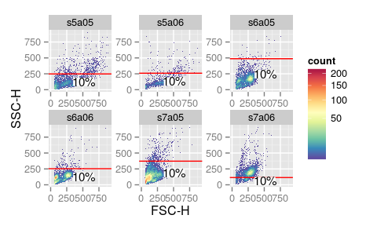 

```r
# 1d gate on density plot
ggcyto(fs, aes(x = `FSC-H`)) + geom_density(fill = "black", aes(y = ..scaled..)) + geom_gate(den.gates.x)  + geom_stats(type = "count")
```

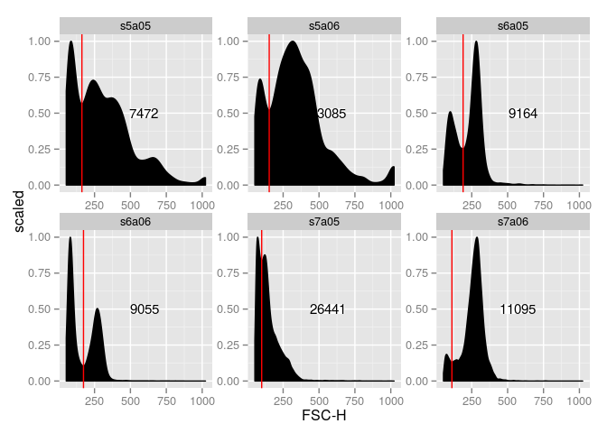 

```r
# add stats layer for each gate layer implicitly
p + geom_gate(poly.gates) + geom_gate(rect.gates) + geom_stats(size = 3)
```

 

```r
# add stats layer only for one gate explicitly
p + geom_gate(poly.gates) + geom_gate(rect.gates) + geom_stats(gate = poly.gates, size = 3)
```

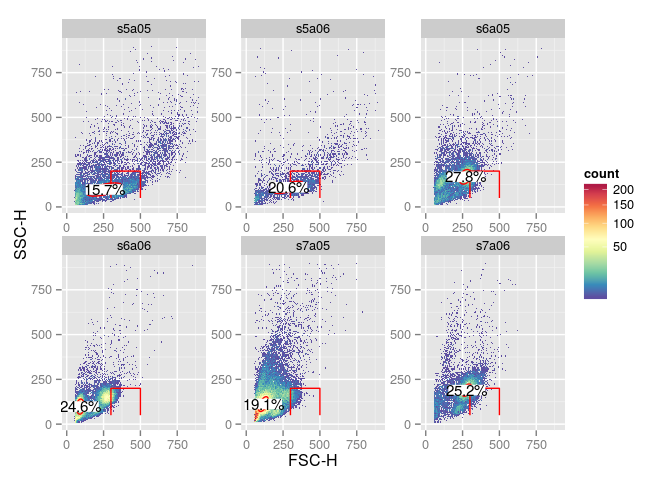 


