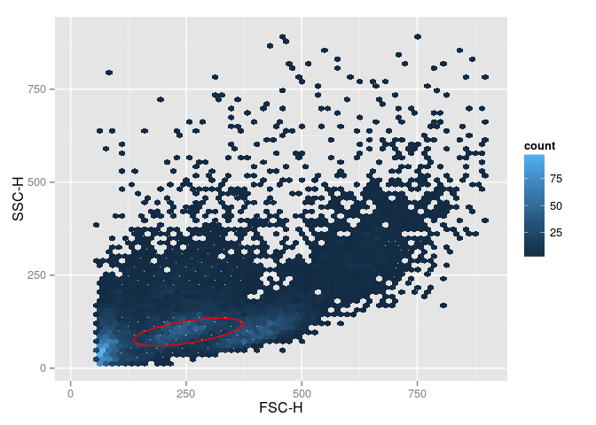
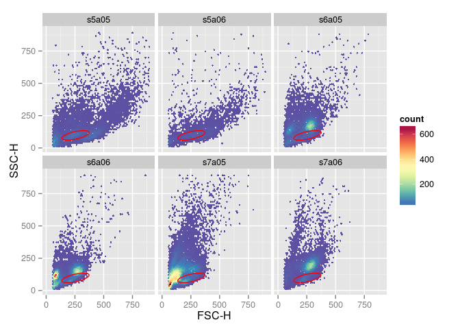
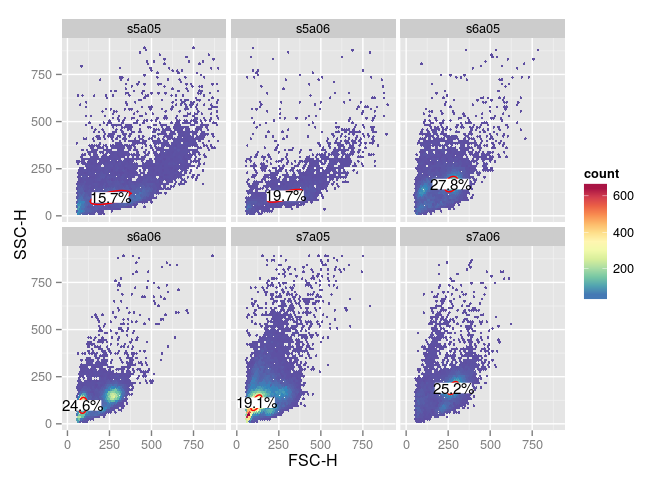

# Visualize gates on cytometry data with ggplot2
Mike Jiang  
04/13/2015  


`ggcyto` makes `ggplot2` to be able to work with `Cytometry` data, namely `flowSet/ncdfFlowSet` or `flowFrame` S4 objects.


```r
library(ggcyto)
data(GvHD)
fs <- GvHD[subset(pData(GvHD), Patient %in%5:7 & Visit %in% c(5:6))[["name"]]]
fr <- fs[[1]]
```


```r
# get a lymphGate
lg <- flowStats::lymphGate(fr, channels=c("FSC-H", "SSC-H"),scale=0.6)
norm.filter <- lg$n2gate
#extract the polygonGate
poly.g <- flowViz:::norm2Polygon(filterDetails(lg[["n2gateResults"]], identifier(norm.filter)))
p <- ggplot(fr, aes(x = `FSC-H`, y =  `SSC-H`))
p <- p + stat_binhex(bin = 64) + ylim(c(10,9e2)) + xlim(c(10,9e2))   

# add polygonGate layer
p1 <- p + geom_gate(data = poly.g)
p1
```

 

```r
# add rectangleGate layer (2d)
rect.g <- rectangleGate(list("FSC-H" =  c(300,500), "SSC-H" = c(50,200)))
p1 <- p1 + geom_gate(data = rect.g)
p1
```

 

```r
# add 1d rectangleGate layer
rect.g1d <- rectangleGate("FSC-H" =  c(550, Inf))
p1 + geom_gate(data = rect.g1d) # vline
```

 

```r
p1 + geom_gate(data = rectangleGate("SSC-H" = c(550, Inf))) #hline
```

 

```r
# n samples + 1 gate
myColor <- rev(RColorBrewer::brewer.pal(11, "Spectral"))
myColor_scale_fill <- scale_fill_gradientn(colours = myColor)
p <- ggplot(fs, aes(x = `FSC-H`, y =  `SSC-H`)) + myColor_scale_fill + stat_binhex(bin = 64) + ylim(c(10,9e2)) + xlim(c(10,9e2)) + facet_wrap(~name)    
p + geom_gate(data = poly.g)
```

 

```r
# n samples + n gates
#fit norm2 filter to multiple samples
fres <- filter(fs, norm.filter)
#extract the polygonGate for each sample
poly.gates <- lapply(fres, function(res)flowViz:::norm2Polygon(filterDetails(res, "defaultLymphGate")))

# add a list of gates as gate layer
# Note: pData must be explicitly passed to geom_gate layer for facetting
p + geom_gate(data = poly.gates, pd = pData(fs))
```

 

```r
# add stats
stats <- compute_stats(fs, poly.gates, type = "percent")# calculate cell % and ccentroid of the gates
p + geom_gate(data = poly.gates, pd = pData(fs)) + geom_btext(data = stats , aes(label = percent))
```

 

```r
# a list of 1d gate
den.gates <- fsApply(fs, openCyto::mindensity, channel = "FSC-H", gate_range = c(100, 300), adjust = 1)
p + geom_gate(data = den.gates, pd = pData(fs))
```

 

```r
# 1d gate on another dimesion
den.gates <- fsApply(fs, openCyto::mindensity, channel = "SSC-H", gate_range = c(100, 500), adjust = 1)
# add stats
stats <- compute_stats(fs, den.gates)# calculate cell % and ccentroid of the gates
p + geom_gate(data = den.gates, pd = pData(fs)) + geom_btext(data = stats , aes(label = percent), bgfill = "yellow")
```

 

```r
# 1d gate on density plot
p1 <- ggplot(fs, aes(x = `SSC-H`)) + geom_density(aes(y = ..scaled..),fill = "black") + facet_wrap(~name) 
p1 <- p1 + geom_gate(den.gates, pd = pData(fs), limit = c(0, 1e3)) 
#must define y aes here since ggplot object does not have y defined in aes
p1 + geom_btext(data = stats , aes(label = percent, y = density))
```

 


